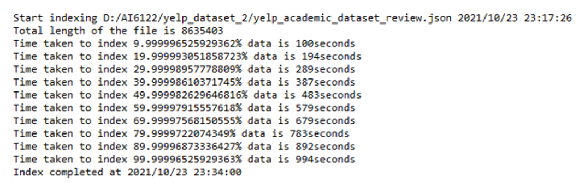

# Simple-Search-Engine
 Development of a Simple Search Engine by using Apache Lucene   
### Dependent Libraries

Two third-party libraries are needed for implementing the search engine: Apache Lucene library (Version 8.10.1): https://lucene.apache.org/ and JSON.simple (Version 1.1.1): https://code.google.com/archive/p/json-simple/.

### Setup guide

Firstly, add the above-mentioned two third-party libraries to your JAVA project build path. Then add the necessary Lucene JARs to the CLASSPATH. There are in total three of them: lucene-analyzers-common-8.10.1.jar, lucene-core-8.10.1.jar and lucene-queryparser-8.10.1.jar. 

After that, depending on which field you want to search for, call different search methods from the QASearcher.java file. Specifically, call searcher.search() for searching text-typed fields. Call searcher.stringSearch for searching string-typed fields. Call searcher.numSearch for searching number-typed fields. (You may refer to the image below as an example.)

The query format and the number of available searching parameters are also shown in the image. Users should formulate their search query by inputting the name of the field, terms or keywords to search for and the maximum number of returned results respectively. The code searcher.printResult(hits) will display the searched results for you. 

### Explanations of sample output

First of all, when the code is running for the first time, the indexer will process all the fields and create the inverted index table for them. During this process, detailed information such as the number of lines in the processing file, the time needed for indexing every 10% of the data will be shown in the IDE console window. 

After that, when you pass in your desired search query into the system, for example, searching for 50 results of the phrase “really lovely place” in the “text” field, the following results will be shown in the console window:

Arranged by the order of decreasing score, all 50 documents will be shown. A snippet which includes all the searchable fields and the document ID will be displayed for a quick view. For the top result, there will also be a special term frequency analysis, which explains well why it will get the highest score.

